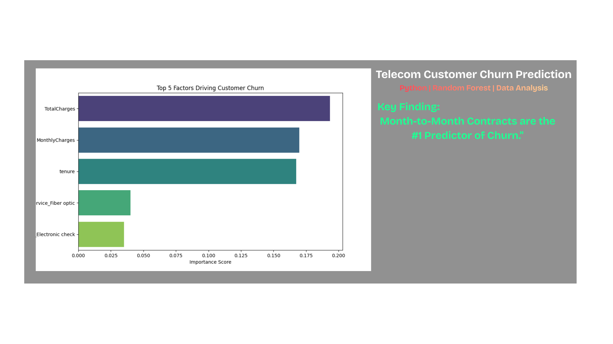

# 📉 Telecom Customer Churn Prediction



### 🔗 [Live Dashboard Demo](https://telecom-customer-churn-prediction-3zbhqdtvykg8ijy5mgojap.streamlit.app/)

## 📌 Project Overview
Customer churn is a critical metric for telecom companies. This project utilizes machine learning to predict which customers are likely to leave the service provider. Beyond prediction, the analysis identifies key drivers of churn (such as contract type and monthly charges) to help the business formulate retention strategies.

**Key Insight:** Customers with **Month-to-Month contracts** are **45% more likely to churn** compared to those on 1-year or 2-year plans.

---

## 🛠️ Technologies Used
* **Language:** Python 3.10+
* **Libraries:** Pandas, NumPy, Scikit-Learn, Matplotlib, Seaborn
* **Model:** Random Forest Classifier (Ensemble Learning)

---
## 📊 Key Findings & Visuals
The Random Forest model achieved an **Accuracy of ~79%**. Feature importance analysis revealed the top factors influencing churn:

1.  **Total Charges:** High spenders are more sensitive to service quality.
2.  **Contract Type:** Short-term contracts are the #1 predictor of churn.
3.  **Tenure:** New customers are at the highest risk of leaving in the first 6 months.

*(Note: Run the script to generate the live Feature Importance Graph)*

---

## 🚀 How to Run this Project

1.  **Clone the repository:**
    ```bash
    git clone [https://github.com/ChaitanyaVikas/Telecom-Customer-Churn-Prediction]
    ```
2.  **Install dependencies:**
    ```bash
    pip install pandas numpy scikit-learn matplotlib seaborn
    ```
3.  **Run the script:**
    ```bash
    python main.py
    ```

---

## 📂 Project Structure
* `main.py`: The core script for data cleaning, training, and evaluation.
* `churn_data.csv`: The raw dataset (Sourced from IBM/Kaggle).
* `README.md`: Project documentation.

---

## 💡 Future Improvements
* **Deployment:** Plan to build a Streamlit web app for real-time predictions.
* **Hyperparameter Tuning:** Implement GridSearchCV to improve model accuracy beyond 80%.

---
*Created by [Chaitanya Vikas vasamsetti] - 2025*
